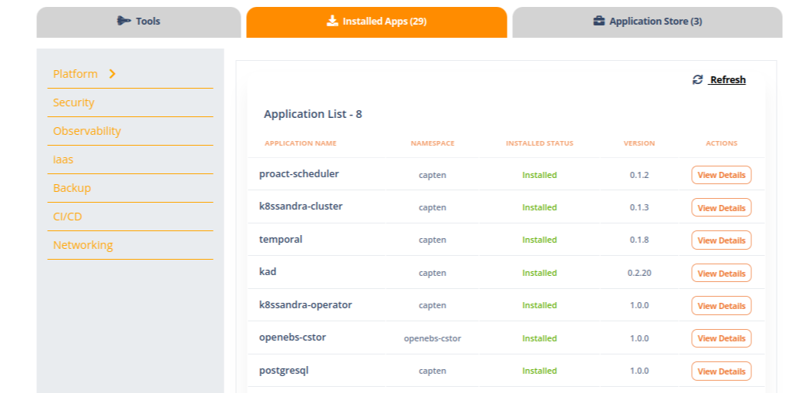

The open-source platform for creating the cluster,deploying the application and destroying the cluster.
[](https://github.com/intelops/capten/actions/workflows/cli_release.yaml)
[](https://github.com/intelops/capten/actions/workflows/github-code-scanning/codeql)


<hr>

## CAPTEN BY INTELOPS

Capten streamlines the management of Kubernetes clusters, making it an ideal solution for teams or individuals who require automated cluster provisioning, application deployment, and lifecycle management in their development and testing workflows.

The all-in-one DevSecOps platform facilitates close collaboration to build and manage cloud-native ecosystems for application and infrastructure modernization, automation, and security.

## How to install and run Capten

#### Prerequisites

* Cloud Provider Account- As of now ,capten supports creating cluster in `AWS` and `Azure`.Ensure that you have permissions to create and manage resources.

* Azure CLI (Needed in case of using Azure cloud for cluster setup)

* Docker 

* kubernetes


## Capten Installation

As of now,we are supporting CLI for cluster creation and destruction for linux os.For supporting in any environment irrespective of os,we have  containerized the process of cluster creation using docker.


#### Setting up the cluster Through Capten CLI:

1.Extract the latest release from the capten repo.[release page](https://github.com/intelops/capten/releases).

2.Confifure the specification need for creating the cluster.Before installation,please do the necessary configuration ,as explained [here](/_index.en.md)

3.Then use the below commands to create cluster ,setup application and to destroy the cluster.

* For creating the cluster

```bash
./capten create cluster --cloud=<cloudtype> --type=talos
```
Based on your requirement,you can specify the cloud type as either **aws** or **azure**

##### verification of cluster creation

Verify the cluster creation process by checking whether the kubeconfig is created or not under [config](https://github.com/intelops/capten/tree/main/config) directory.And also you can verify by checking [capten-lb-endpoint.yaml](https://github.com/intelops/capten/blob/main/config/capten-lb-endpoint.yaml) updated with load balancer ip(incase of azure) and hostname(incase of aws) .If the kubeconfig is created,export the kubeconfig and check the status of node by using below command.

* sample command for exporting kubeconfig

```bash
export KUBECONFIG=/home/capten/config/kubeconfig
```

```bash
kubectl get nodes
```
* For setting up the application in cluster

```bash
./capten setup apps
```
In default,it'll install all the applications related to security,storage,certificate management and much more applications which you can see in [default-groups.yaml](https://github.com/intelops/capten/blob/main/apps/default_group_apps.yaml) and [core-groups.yaml](https://github.com/intelops/capten/blob/main/apps/core_group_apps.yaml)

##### verification of app deployment

you can view the list of applications deployed using the helm command given below

```bash
helm list -A
```

##### Note:
Capten also provides flexibility to deploy the specific applications as needed.You can install the required application by removing or commenting out  the application name in the [default-groups.yaml](https://github.com/intelops/capten/blob/main/apps/default_group_apps.yaml)

After setting up the application,you can see the certificates being created in `cert` folder.

* For destroying the cluster

```bash
./capten destroy cluster
```

* For showing the cluster Information

```bash
./capten show cluster info
```


#### Cluster Creation through Docker Container:

For creating the cluster,run the below command

```bash
docker run -v /path/to/aws_config.yaml:/app/config/awsorazure_config.yaml -it ghcr.io/intelops/capten:<latest-image-tag>  create cluster --cloud=aws --type=talos
```

In order to verify the cluster creation,you can see the kubeconfig file inside the config folder in the container.


#### Note: 
After installation,need to update the DNS entry for the cluster domain in aws console or on any cloud provider.

Before Updating the dns,please make sure to configure the domain name in the `capten.yaml` as specified [here](/_index.en.md)

Update the domain Name and lbip in dns as specified in the `capten.yaml` and `capten-lb-endpoint.yaml` which is under `config` directory

The DNS entry update allows users to access applications like Grafana and Loki through the specified domain.

#### How to verify the successful updation of dns?

Consider the domain name as `aws.intelops.com`,once after the updation,use the nslookup command to verify the successful domain updation.
```bash
nslookup capten.aws.intelops.apps
```

## CAPTEN UI

### How to Access the UI?

1. If you are a new user,[Click here](https://alpha.intelops.app/login) to create a new account by signing up .   

2. If you are already registered  user,just login with your credentials

3. After registering as a new user,you ll see the popup screen for creating organisation.Create organisation and assign the specific role.

##### Note:

For registering the cluster in UI ,you must have cluster admin role.

### Registering Controlplane cluster


1. Provide the cluster name  and upload the certificates created when apps are deployed.

2. Follow this format for providing cluster agent endpoint

```bash
https://captenagent.<domainname>
```
For eg,if you specify domain name as 'aws.eg.com',then cluster agent endpoint will be 

```bash
https://captenagent.aws.eg.com
```      

3. After providing above details,register the cluster.

In the above steps ,we are registering the controlplane cluster  in the Intelops UI.

### Capten Cluster Applications Management

After registering the cluster ,you can see the installed apps in installed tab .



Additionally,you can also see the applications in the application store tab(CI/CD ,IAAS ,testing framework tools).As of now we are supporting,

       * argocd
       * tekton
       * crossplane
       * testkube.

you can also deploy the above applications in the control plane cluster which is needed for Business cluster creation (argocd,crossplane) 

By default ,we are supporting  to deploy applications related to observability,security,backup,networking and platform tools.

Additionally in the application store,we also have CI/CD tools, IAAS tool and testing framework that can be deployed as per user requirement.

#### Capten Observability

We also have launched UI for applications like grafana,signoz,argocd and tekton.We are supporting SSO for all these appliactions.

So once after logging in grafana via SSO,you can view certain dashoards.With the help of dashboards,following operations could be performed

* monitoring tha applications using logs 
* monitoring and collecting the metrics of each applications in the cluster like node,cpu usage,memory usage,cluster health, resource utilizations etc.


**Note:
  We have separate dashboards for each application for monitoring purpose 

### DeRegistering the Controlplane cluster

Click the remove button to deregister the controlPlane cluster.


## Capten Crossplane Plugin

### Onboard cluster resources:
### Git Project:
1. First to add crossplane plugin, we need to add an empty private repository.
2. In onboarding section, go to **Git** tab and click *Add Git Repo*.
3. Enter the git repo url and the token and also set the label to crossplane.

### Cloud Provider:
1. Now to add cloud provider, go to **Cloud Providers** and click * Add Cloud Provider*.
2. Select the required cloud provider and enter the credentials for the same. (The label is set to crossplane)

**Note:** The label *crossplane* is used by the crossplane plugin to reference both the repository and provider.

## Create Crossplane provider:
1. In platform engineering section, select *Setup* under **Crossplane** plugin.
2. Under providers section, select both the provider you need and 'crossplane' label.
3. Under configure section, click sync next to the repo which you need to deploy the plugin.
4. After the sync, the provider will get deployed and enter *Healthy* state in a few minutes.

## Create Business cluster
1. After the sync is successful, the crossplane objects and its argocd applications are added to the empty repository under the infra directory.
2. Go to infra/clusters/cluster-configs/cluster-claim.yaml
3. Uncomment the cluster-claim.yaml file (or add your required changes)
4. Go to argocd UI page and sync all crossplane related applications
5. After the clusterclaim is created, the business cluster creation will get triggered.

## Delete Business cluster
1. To delete the business cluster, remove all applications from the business cluster.
2. Go to infra/clusters/cluster-configs and remove cluster-claim.yaml
3. Now prune sync the cluster-config-app application (watching the cluster-claim.yaml).
4. This will trigger the business cluster deletion

## Delete Crossplane provider
1. To delete crossplane provider, go to capten UI.
2. Under platform engineering, select *Setup* under **Crossplane** plugin
3. Under providers section, select the delete option next to the provider you need to delete.
4. This removes the provider from the cluster
5. You can also remove the provider from onboarding list by the delete option provided with the cloud provider

