The open-source DevSecOps platform for manging cloud infrastructure and cloud-native applications.
[](https://github.com/intelops/capten/actions/workflows/cli_release.yaml)
[](https://github.com/intelops/capten/actions/workflows/github-code-scanning/codeql)

<hr>

## CAPTEN By INTELOPS

Capten streamlines the management of Kubernetes clusters, making it an ideal solution for teams or individuals who require automated cluster provisioning, application deployment, and lifecycle management in their development and testing workflows.

The all-in-one DevSecOps platform facilitates close collaboration to build and manage cloud-native ecosystems for application and infrastructure modernization, automation, and security.

## How to Install Capten Controlplane Cluster

Capten controlplane cluster creation supported with Capten CLI, Capten CLI distribution available for Linux, Winodws and MacOS.
Capten controlplane cluster creation supported on public cloud providers like AWS and Azure.

#### Prerequisites

- AWS or Azure clound provider account

- Azure CLI (Needed in case of using Azure cloud for cluster setup)

- Docker (Needed in case of using Capten CLI distribution on Windows or MacOS)

- kubectl tool to access Capten controlplane cluster

#### Setting up the cluster

1. Download and Extract Capten package from Capten github repoistory [release page](https://github.com/intelops/capten/releases).

```bash
wget https://github.com/intelops/capten/releases/download/v1.0.0/capten-v1.0.0.tar.gz
tar -xvf capten-v1.0.0.tar.gz
```

2. Preparted the cluster installation parameters

Update cluster installation parameters:
For AWS cluster, update cluster installation parameters in the `aws_config.yaml` in `config` folder.

| Parameter               | Description                                                                        |
| ----------------------- | ---------------------------------------------------------------------------------- |
| AwsAccessKey            | Access key for AWS authentication                                                  |
| AwsSecretKey            | Secret key for AWS authentication                                                  |
| AlbName                 | Name of the Application Load Balancer (ALB)                                        |
| PrivateSubnet           | CIDR block for the private subnet(s)                                               |
| Region                  | AWS region where the resources will be deployed                                    |
| SecurityGroupName       | Name of the security group that controls inbound and outbound traffic              |
| VpcCidr                 | CIDR block for the Virtual Private Cloud (VPC)                                     |
| VpcName                 | Name of the Virtual Private Cloud (VPC)                                            |
| InstanceType            | Type of EC2 instance                                                               |
| NodeMonitoringEnabled   | Flag indicating whether node monitoring is enabled or not (true/false)             |
| MasterCount             | Number of master nodes                                                             |
| WorkerCount             | Number of worker nodes                                                             |
| TraefikHttpPort         | Port number for HTTP traffic handled by Traefik load balancer                      |
| TraefikHttpsPort        | Port number for HTTPS traffic handled by Traefik load balancer                     |
| TalosTg                 | Name of the target group for Talos instances                                       |
| TraefikTg80Name         | Name of the target group for port 80 traffic handled by Traefik                    |
| TraefikTg443Name        | Name of the target group for port 443 traffic handled by Traefik                   |
| TraefikLbName           | Name of the Elastic Load Balancer (ELB) used by Traefik                            |
| TerraformBackendConfigs | Configuration settings for Terraform backend (bucket name and DynamoDB table name) |

For Azure cluster, update cluster installation parameters in the `azure_config.yaml` in `config` folder.

| Parameter            | Description                                                       |
| -------------------- | ----------------------------------------------------------------- |
| Region               | The Azure region where resources will be deployed                 |
| MasterCount          | Number of master nodes                                            |
| WorkerCount          | Number of worker nodes                                            |
| NICs                 | Network Interface Controllers (NICs) for master nodes             |
| WorkerNics           | Network Interface Controllers (NICs) for worker nodes             |
| InstanceType         | Type of virtual machine instance used for nodes                   |
| PublicIpName         | Names of public IP addresses assigned to the nodes                |
| TraefikHttpPort      | Port number for HTTP traffic handled by Traefik load balancer     |
| TraefikHttpsPort     | Port number for HTTPS traffic handled by Traefik load balancer    |
| Talosrgname          | Resource group name for the Talos deployment                      |
| Storagergname        | Resource group name for storage-related resources                 |
| Storage_account_name | Name of the storage account used for storing images               |
| Talos_imagecont_name | Name of the container within the storage account for Talos images |
| Talos_cluster_name   | Name of the Talos cluster                                         |
| Nats_client_port     | Port number for NATS client communication                         |

3. Prepare cluster application deployment parameters

Update cluster application deployment parameters in the `capten.yaml` in `config` folder.

| Parameter         | Description                                                                      |
| ----------------- | -------------------------------------------------------------------------------- |
| DomainName        | Name of the domain needed for exposing the application                           |
| ClusterCAIssuer   | The issuer of the Cluster Certificate Authority (CA) for cluster security        |
| SocialIntegration | The social platform like teams or slack integrated for alerting purpose          |
| SlackURL          | Slack channel url (needs to be provided if slack is used for social integration) |
| SlackChannel      | Name of the slack channel                                                        |
| TeamsURL          | Teams channel url (needs to be provided if teams is used for social integration) |

4. Create cluster

For creating the cluster, execute below command

```bash
./capten create cluster --cloud=<cloudtype> --type=talos
```

Note: Cloud type supported are 'aws' and 'azure'

- Cluster Creation through Docker Container:

For creating the cluster through docker container (needed in case of using Capten CLI distribution on Windows or MacOS ), run the below command

```bash
docker run -v /path/to/aws_config.yaml:/app/config/awsorazure_config.yaml -it ghcr.io/intelops/capten:<latest-image-tag>  create cluster --cloud=aws --type=talos
```

Post cluster creation, `kubeconfig` will be generated to `./config/kubeconfig`.
Access cluster using generated kubeconfig with kubectl

```bash
export KUBECONFIG=/home/capten/config/kubeconfig
kubectl get nodes
```

#### Setting up the cluster applications

For deploying the cluster applications, execute below command

```bash
./capten setup apps
```

Capten CLI will deploy Capten application suite and Capten Agent on Controlplane cluster.
Post application deployment, mTLS certificates are generated to access Capten Agent. mTLS certificates `capten-client-auth-certs.zip` generated in `cert` folder.

Deployed applications can be listed with helm tool

```bash
helm list -A
```

#### Show the cluster info

```bash
./capten show cluster info
```

#### Destroying the cluster

Cluster destruction command initiates the process of removing all components associated with the cluster, such as virtual machines, instances, nodes, networking configurations, and any other resources provisioned for the cluster. It effectively undoes the setup and configuration of the cluster, deallocating resources and ensuring they are no longer in use. This command can be used when the cluster is no longer needed or to clean up resources in cloud computing, distributed systems, or container orchestration environments.

```bash
./capten destroy cluster
```

# CAPTEN UI

## How to Access the Capten UI?

1. For a new user, sign up on Intelops UI (https://alpha.intelops.app/)

2. For existing user, login with user credentials

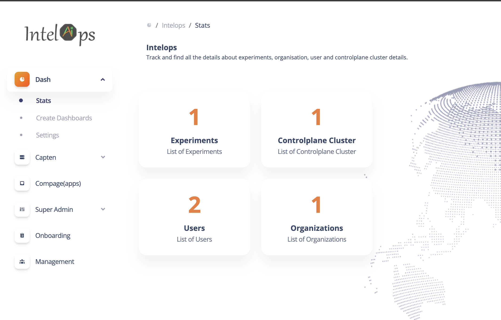

3. After login to Intelops UI, for new user, popup screen will be displayed for creating organisation. Create organisation and assign the roles, add cluster admin role to register new cluster

## Registering Controlplane cluster

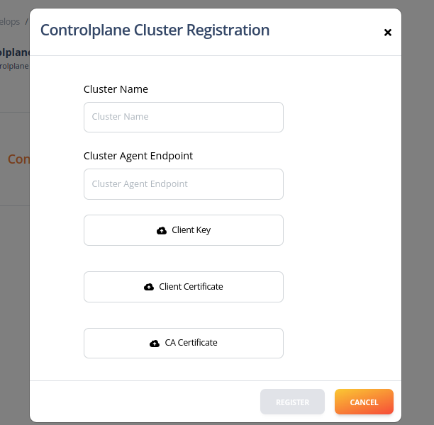

1. Provide the cluster name and upload the client certificates created by Capten CLI.

2. Provide the cluster agent endpoint, Domainname configured in capten.yaml to be used for accessing the cluster

```
https://captenagent.<domainname>
```

For example agent endpoint, if 'aws.eg.com' Domainname is configure in capten.yaml,

```
https://captenagent.aws.eg.com
```

3. After providing above details, register the cluster.

### Capten Cluster Applications Management

Capten supports Web UI luanch for supportted applications, Web UI launch supported for default applications like grafana, signoz.

Navigate for Capten controlplane cluster by clicking on the Registered cluster.
Web UI launch applications listed on "Tools" tab

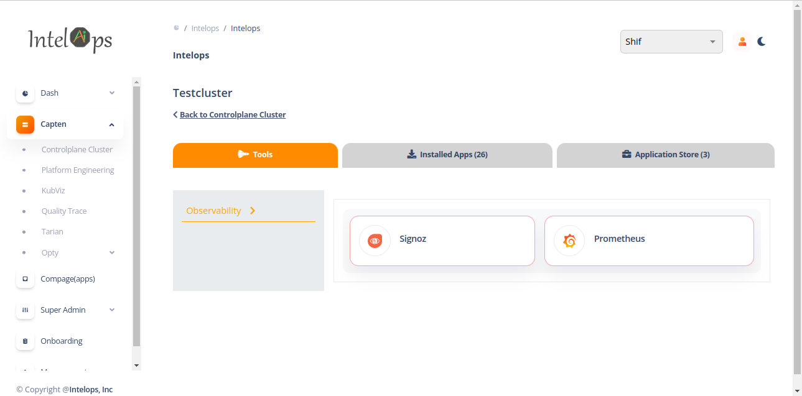

Launching the grafana Web UI and access grafana dashboards
Click on "Prometheus" Icon to launch grafana Web UI. Web UI will be launched with single sign-on and show grafana landing page, from there navigate to view dashboards

One of the cluster-overview metrics dashboards is as shown below

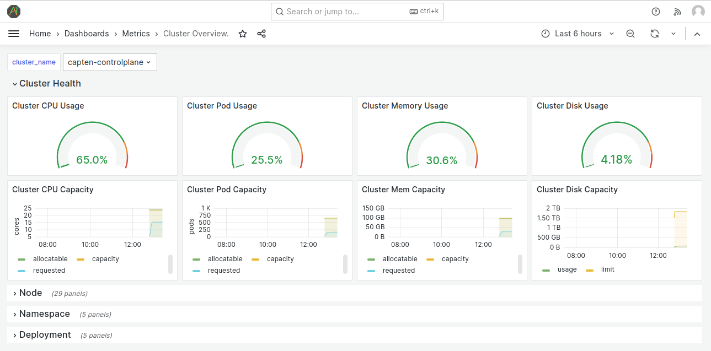

### DeRegistering the Controlplane cluster

Navigate for Capten controlplane cluster, Click the remove button to deregister the controlPlane cluster, it will delete registration data from Intelops cluster, to delete cluster, Capten CLI will have to be used.

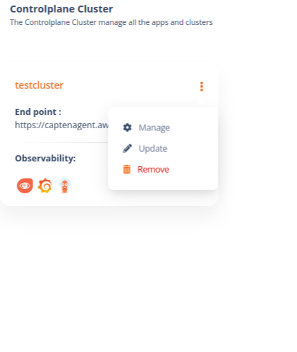

# Capten Plugin SDK

## Overview

Capten Plugin SDK to develop and deploy applications on Capten cluster

## Features

- Onboard Plugin applications in to Capten Plugin Store
- Deploy Plugin applications on Capten cluster
- Deploy Plugin applications on Business cluster
- Capten Cluster Storage service access for Plugin application
- Capten Cluster Vault service access for Plugin application
- Capten Cluster SDK API service access for Plugin application
- Enabling Single SignOn for Plugin application UI

## Capten Plugin Store

Capten SDK provides a simple way to onboard the Capten Plugin Applications (Plugins or Plugin Apps) into the Capten Plugin Store.

### Central Plugin Store

Intelops manages the central plugin store Git repository (https://github.com/intelops/capten-plugin) to onboard and manage Capten Plugin applications. This is an open-source repository for the Capten community to onboard and manage Capten Plugin applications.

This Central Plugin Store is integrated with Capten Stack by default, and Plugins available in the Central Plugin Store can be deployed on the Capten cluster from the Capten UI.

### Local Plugin Store

Capten SDK supports managing a local plugin store, i.e., in your Git repository. A Git repository needs to be integrated into the Capten from Capten UI, which can then be used to onboard and manage Plugin applications.

## Onboarding Plugin Application

Pre-requisites to onboard Plugin Application into this Capten Plugin Store

### Prerequisites

- Plugin Application available in helm repository accessible from Capten cluster
- Container image for plugin application available in container registry onboarded into the Capten cluster

### Add Plugin Application name

Add the plugin application name in `plugin-store/plugin-list.yaml` file

```
plugins:
  - argo-cd
  - crossplane
  - tekton
```

### Add Plugin Application Configuration

Create a folder with plugin name `plugin-store/<plugin-name>`, and add plugin metadata files

- Add plugin application configuration in `plugin-store/<plugin-name>/plugin-config.yaml` file
- Add plugin application Icon file in `plugin-store/<plugin-name>/icon.svg`

| Attribute   | Description                           |
| ----------- | ------------------------------------- |
| pluginName  | Plugin application name               |
| description | Plugin application description        |
| category    | Plugin application category           |
| icon        | Plugin application icon               |
| versions    | Plugin application supported versions |

```
pluginName: "argo-cd"
description: "GitOps continuous delivery tool for Kubernetes"
category: "CI/CD"
icon: "icon.svg"
versions:
  - "v1.0.2"
  - "v1.0.5"
```

### Add Plugin Application Version Deployment Configuration

For each supported version, create version folder `plugin-store/<plugin-name>/<version>` and add plugin version deployment metadata files

- add plugin application version deployment configuration in `plugin-store/<plugin-name>/<version>/plugin-config.yaml` file
- add plugin application version values file in `plugin-store/<plugin-name>/<version>/values.yaml` file

\*\* plugin application version deployment configuration attributes \*\*
| Attribute | Description |
| ------------------- | ---------------------------------------- |
| chartName | Plugin application chart name |
| chartRepo | Plugin application chart repo |
| version | Plugin application version |
| defaultNamespace | Plugin application default namespace |
| privilegedNamespace | Plugin application privileged namespace |
| valuesFile | Plugin application values file |
| apiEndpoint | Plugin application API endpoint |
| uiEndpoint | Plugin application ui endpoint |
| capabilities | Plugin application required capabilities |

Table below shows an example of plugin application version deployment configuration

| Capabilities                | Description                                                      |
| --------------------------- | ---------------------------------------------------------------- |
| deploy-controlplane-cluster | Capability to deploy plugin application on control plane cluster |
| deploy-bussiness-cluster    | Capability to deploy plugin application on business cluster      |
| capten-sdk                  | Capability to access Capten cluster SDK                          |
| ui-sso-oauth                | Capability to enable Single SignOn for plugin application UI     |
| postgress-store             | Capability to access Capten cluster storage service              |
| vault-store                 | Capability to access Capten cluster vault service                |

```
deployment:
  controlplaneCluster:
    chartName: "argo-cd"
    chartRepo: "https://kube-tarian.github.io/helmrepo-supporting-tools"
    version: "v1.0.2"
    defaultNamespace: "argo-cd"
    privilegedNamespace: false
    valuesFile: "values.yaml"
apiEndpoint: https://argo.{{.DomainName}}
uiEndpoint: https://argo.{{.DomainName}}
capabilities:
  - deploy-controlplane-cluster
  - capten-sdk
  - ui-sso-oauth
```

### Publish Plugin Application

Merge all plugin configuration files into the capten plugin store Git repository

## Depoly Plugin Application

Deploy Plugin application on Capten cluster from Intelops UI(https://alpha.intelops.app/)

#1 Login to Intelops UI

# #2 Navigate to "Controlplance Cluster" -> Select the cluster -> Select "Application Store"

Capten SDK creates resources for plugin applications for plugin-configured capabilities before deploying plugin applications to the Capten cluster.

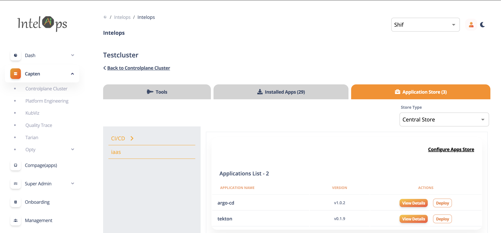

#3 Select "Configure Apps Store" and click on "sync' button to Synchronize the plugin store

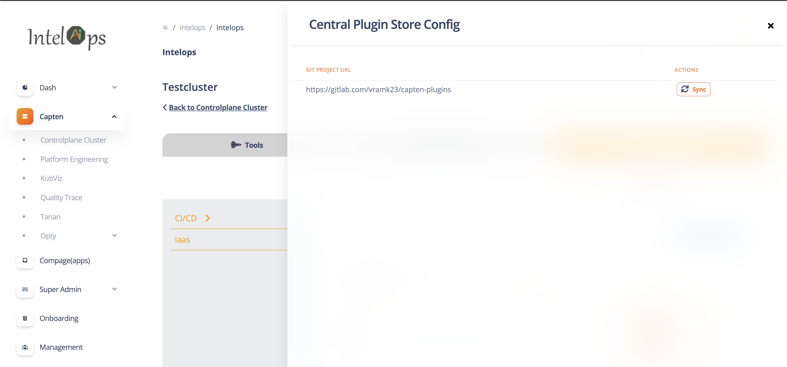

#4 Click on Deploy plugin application, Select plugin version and click on Deploy button

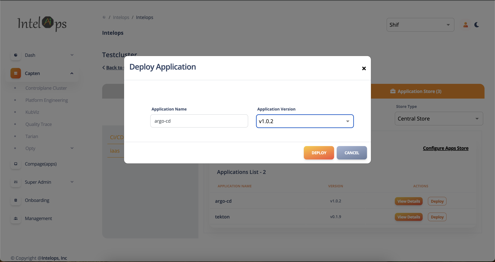

### Capten Pluguin Resources/Environment

Capten SDK creates resources for plugin application for the configured capabilities before deploying plugin application to Capten cluster

List of supported capabilities:

```
- Capten SDK
- Vault Store
- Postgres Store
```

#### Capten SDK

- This capability provides MTLS certificate for server and client authentications.
- Plugin application uses client certificate to communicate with Capten agent.
- Plugin application can server certificate to enable mtls for communication.

#### Vault Store

- This capability provides access to key secrets.

#### Postgres Store

- This capability provides postgres DB setup required for the plugin application.

## Plugin Application UI launch

- Plugin application UI can be launched directly from icons shortcut in cluster widget.

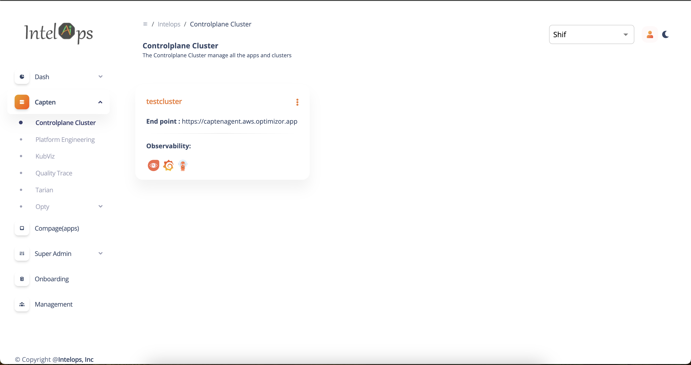

## Plugin Application Capten UI Widget

- Navigate to "Capten" -> "Platform Engineering"
- In this screen plugin application can be visualized.

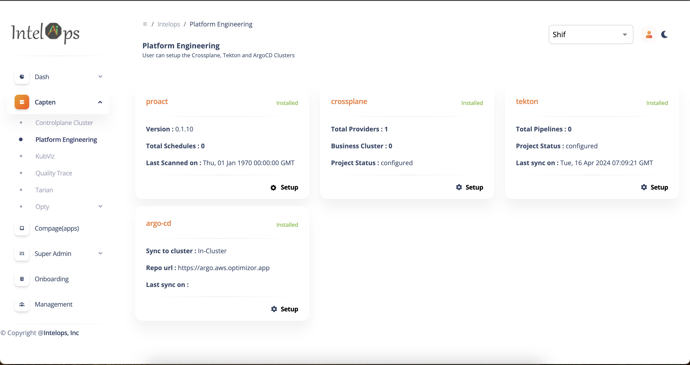

# Capten Crossplane Plugin

## Onboard cluster resources:

### Git Project:

1. First to add crossplane plugin, we need to add an empty private repository.
2. In onboarding section, go to **Git** tab and click _Add Git Repo_.
3. Enter the git repo url and the token and also set the label to crossplane.

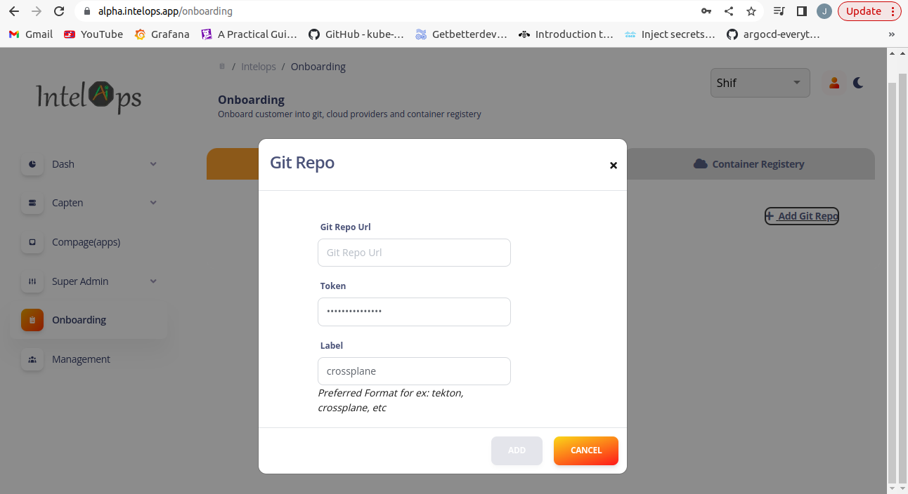

=======
Add git repository details in the mentioned section_

### Cloud Provider:

1. Now to add cloud provider, go to **Cloud Providers** and click _ Add Cloud Provider_.
2. Select the required cloud provider and enter the credentials for the same. (The label is set to crossplane)

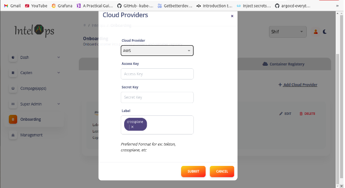

Add cloud provider details in the mentioned section_

**Note:** The label _crossplane_ is used by the crossplane plugin to reference both the repository and provider.

## Create Crossplane provider:

1. In platform engineering section, select _Setup_ under **Crossplane** plugin.
2. Under providers section, select both the required provider and 'crossplane' label.
3. Under configure section, click sync next to the repository which is needed to deploy the plugin.
4. After the sync, the provider will get deployed and enter _Healthy_ state in a few minutes.

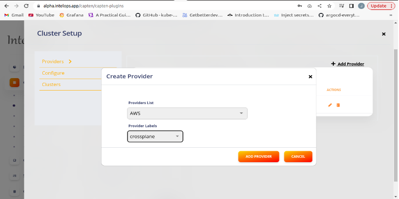

Once onboarding is done both the git and provider details will be automatically populated in crossplane plugin using crossplane label_

## Create Business cluster

1. After the sync is successful, the crossplane objects and its argocd applications are added to the empty repository under the infra directory.
2. Go to infra/clusters/cluster-configs/cluster-claim.yaml
3. Uncomment the cluster-claim.yaml file (or add any required changes)
4. Go to argocd UI page and sync all crossplane related applications
5. After the clusterclaim is created, the business cluster creation will get triggered.

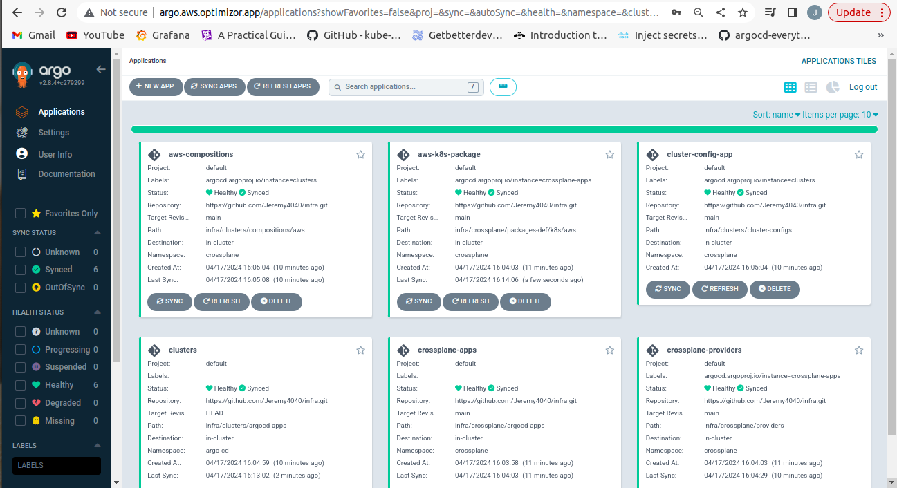

Make sure to sync all crossplane related apps_

## Delete Business cluster

1. To delete the business cluster, remove all applications from the business cluster.
2. Go to infra/clusters/cluster-configs and remove cluster-claim.yaml
3. Now prune sync the cluster-config-app application (watching the cluster-claim.yaml).
4. This will trigger the business cluster deletion

## Delete Crossplane provider

1. To delete crossplane provider, go to capten UI.
2. Under platform engineering, select _Setup_ under **Crossplane** plugin
3. Under providers section, select the delete option next to the provider which is to be deleted.
4. This removes the provider from the cluster
5. It is also possible to remove the provider from onboarding list by the delete option provided with the cloud provider

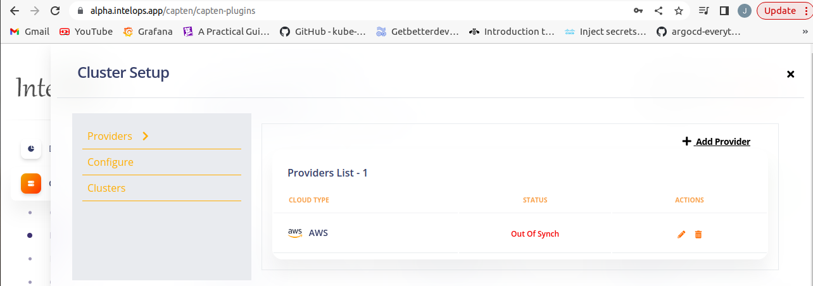

To delete the crossplane provider, click the delete button next to the provider name_

# Tekton Flow For Capten

## Tekton CI/CD Pipeline

1. Login to the capten ui page
2. Onboarding git project in to capten

   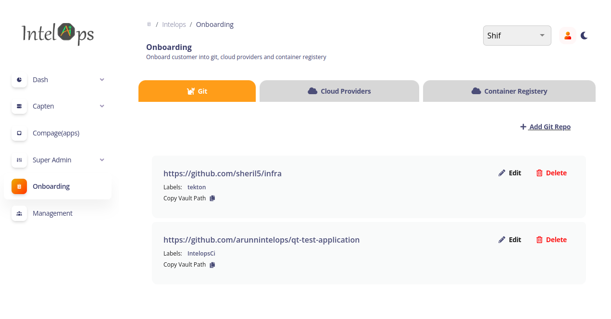
   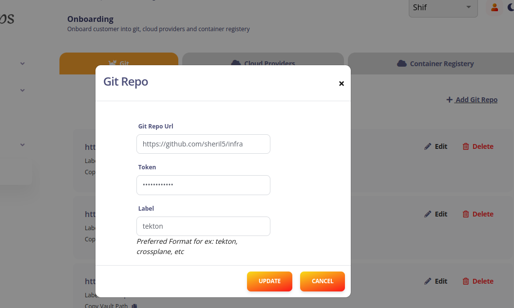

   - select the `add git repo` from the **git** section
   - add the git repo url,access token and label for the customer repo (label is tekton) and the tekton ci/cd repo (label is IntelopsCi)

3. Onboarding container registry in to capten

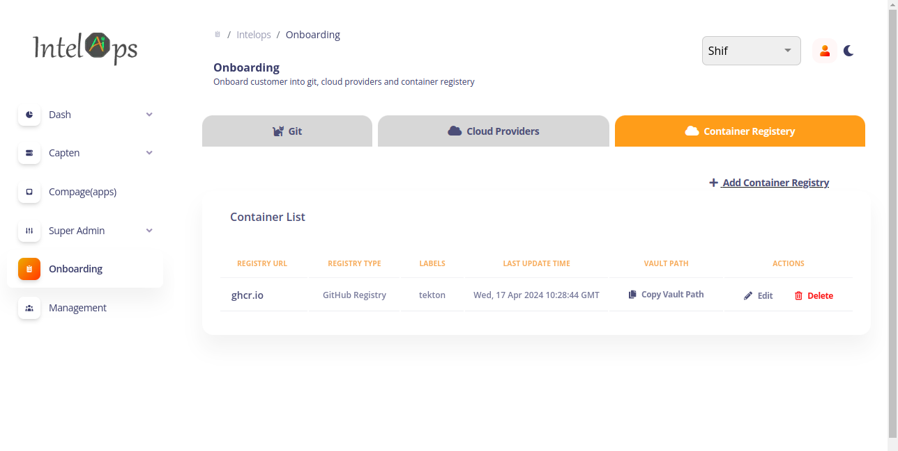
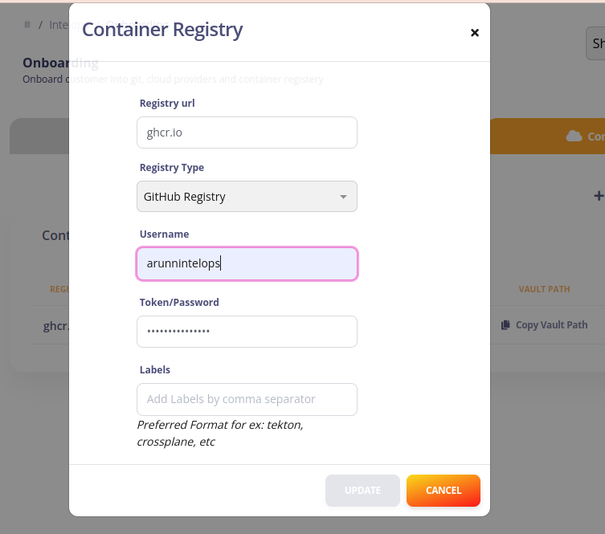

- select `add container registry` from **container registry** section
- add the registry url,username,access token and label to which the built image needs to be pushed (labels is "tekton")

# Configuring Tekton

## Configuring Capten Tekton Plugin

Go to the _capten-->platform engineering_ ,select on the tekton plugin setup and then select the `sync` option under the **configure** section and this will configure the tekton and the neccessary floders will be created in the customer's repo

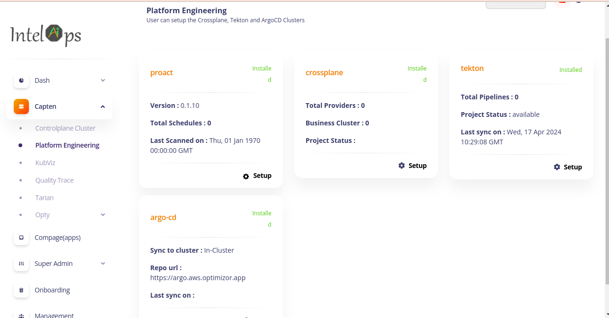

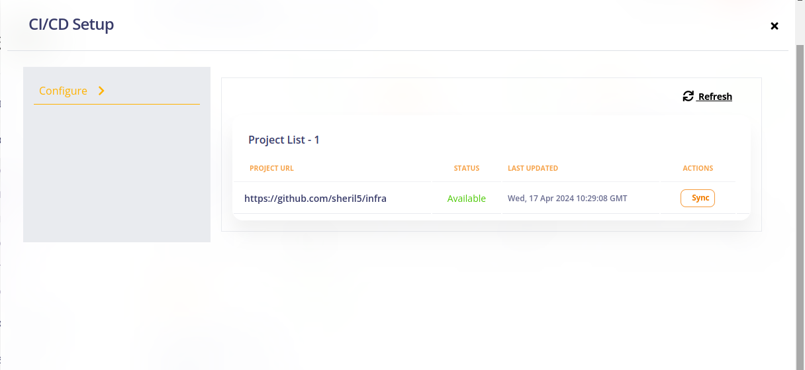

# Pre-requisite For Tekton CI/CD Pipeline Creation

- Use the already created **tekton-pipelines** namespace for the creation of pipeline.

- Create a Clustersecretstore from the yaml given below.Replace the server with the url which can be obtained from the **kubectl** command given below.

  ```bash
  kubectl get ingress -n capten
  ```

       apiVersion: external-secrets.io/v1beta1
       kind: SecretStore
       metadata:
         name: vault-root-store
       spec:
         provider:
           vault:
             server: <"replace with the ingress host obtained from above command">
             path: "secret"
             version: "v2"
             auth:
               tokenSecretRef:
                 name: "tekton-vault-token"
                 key: "token"
                 namespace: tekton

  Here, the **tekton-vault-token** is the secret created in tekton namespace to access the vault

- Git secret

  Go to _onboarding-->git_ under the respective git project the path of the vault where the credentials of git stored can be viewed.copy the path and add it to the path in the external secret yaml as given below

  Annotate the external-secret to specify the domains for which Tekton can use the credentials.

  A credential annotation key must begin with tekton.dev/git- or tekton.dev/docker- and its value is the URL of the host for which Tekton will be using that credential.
  eg-tekton.dev/git-0: https://gitlab.com , tekton.dev/git-0: https://github.com , tekton.dev/docker-0: https://gcr.io

          apiVersion: external-secrets.io/v1beta1
          kind: ExternalSecret
          metadata:
            annotations:
              tekton.dev/git-0: "https://github.com"
            name: gitcred-external
            namespace: tekton-pipelines
          spec:
            refreshInterval: "10s"
            secretStoreRef:
              name: vault-root-store
              kind: SecretStore
            target:
              name: gitcred-capten-pipeline
            data:
            - secretKey: password
              remoteRef:
                key: <vault path cpoied from ui>
                property: accessToken
            - secretKey: username
              remoteRef:
                key: <vault path copied from ui>
                property: userID

- Container registry secret

  Go to _onboarding-->container registry_ under the respective container registry, where the path of the vault where the credentials of container registry stored can be viewed.copy the path and add it to the path in the external secret yaml as given below

         apiVersion: external-secrets.io/v1beta1
         kind: ExternalSecret
         metadata:
           name: docker-external
           namespace: tekton-pipelines
         spec:
           refreshInterval: "10s"
           secretStoreRef:
             name: vault-root-store
             kind: SecretStore
           target:
             name: docker-credentials-capten-pipeline
           data:
           - secretKey: config.json
             remoteRef:
               key: <vault path copied from ui>
               property: config.json

- Cosign docker login secret

  Go to _onboarding-->conatainer registry_ under the respective container registry where the path of the vault in which the credentials of container registry stored can be viewed.copy the path and add it to the path in the external secret yaml as given below

      apiVersion: external-secrets.io/v1beta1
      kind: ExternalSecret
      metadata:
        name: cosign-docker-external
        namespace: tekton-pipelines
      spec:
        refreshInterval: "10s"
        secretStoreRef:
          name: vault-root-store
          kind: SecretStore
        target:
          name: cosign-docker-secret-capten-pipeline
        data:
        - secretKey: password
          remoteRef:
            key: <vault path copied from ui>
            property: password
        - secretKey: registry
          remoteRef:
            key: <vault path copied from ui>
            property: registry
        - secretKey: username
          remoteRef:
            key: <vault path copied from ui>
            property: username

- Argocd secret
  Use the below secret yaml and replace the password with the encoded argocd password which can be obtained by using the **kubectl** command and the server url is obtained from the capten ui under _capten-->platform-engineering_ .Copy the repo url from the argocd setup ,encoded it and add it to the server url.Username is admin ,add the encoded username to the yaml given below

```bash
 kubectl get secrets argocd-initial-admin-secret -n argo-cd
```

      apiVersion: v1
      data:
        PASSWORD: <replace with encoded argocd secret>
        SERVER_URL: <repo url copied from ui>
        USERNAME: <encoded username>
      kind: Secret
      metadata:
        name: argocd-capten-pipeline
        namespace: tekton-pipelines
      type: Opaque

- cosign-keys

  Now the cosign keys secret is automatically created in tekton-pipelines namespace.

- Extra-config secret

  Go to _onboarding-->git_ under the respective git project where the path of the vault in which the credentials of git stored can be viewed.copy the path and add it to the path in the external secret yaml as given below

      apiVersion: external-secrets.io/v1beta1
      kind: ExternalSecret
      metadata:
        name: extraconfig-external
        namespace: tekton-pipelines
      spec:
        refreshInterval: "10s"
        secretStoreRef:
          name: vault-root-store
          kind: SecretStore
        target:
          name: extraconfig-capten-pipeline
        data:
        - secretKey: GIT_TOKEN
          remoteRef:
            key: <vault path copied from ui>
            property: accessToken
        - secretKey: GIT_USER_NAME
          remoteRef:
            key: <vault path copied from ui>
            property: userID

# Prepare Pipeline Resources For The Tekton Pipeline

Now commit the required pipeline,rbac,triggers and ingress in the customer repo under the directory _cicd-->tekton-pipelines-->templates_.
once done the argocd will update this changes to the cluster and the pipeline,triggers,rbac and ingress will be created in the controlplane cluster

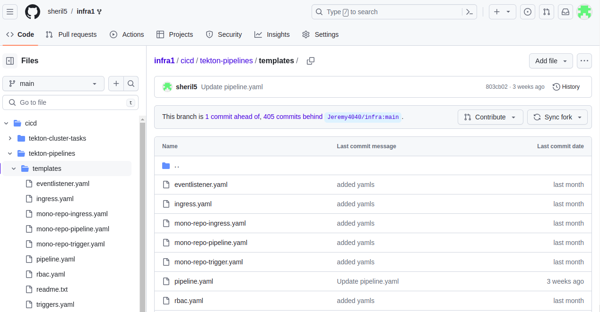

# Triggering Tekton Pipeline

Now add the **webhook url** to the tekton ci/cd repo on which the tekton pipeline needs to be executed upon trigger.
once all the setup is done and now when a changes is commited in the tekton ci/cd repo the tekton pipeline will get executed and the image gets built and pushed to the container registry ,finally the built image will get deployed in the bussiness cluster.

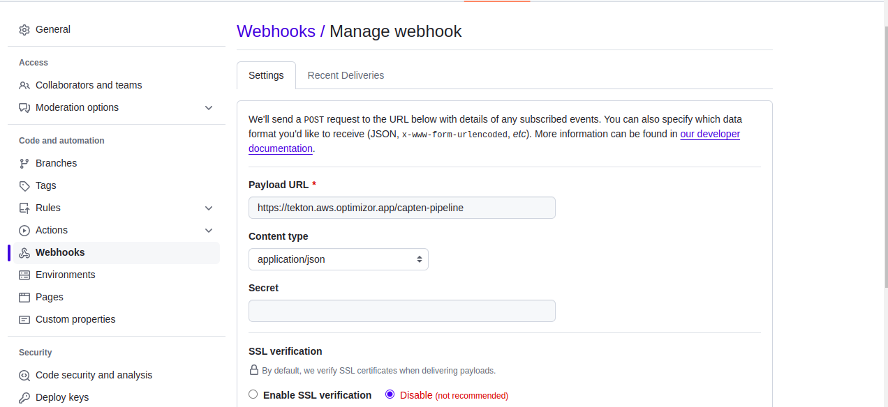
