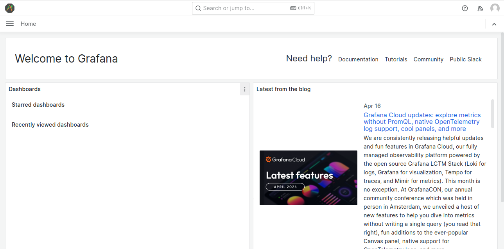

The open-source DevSecOps platform for manging cloud infrastructure and cloud-native applications.
[](https://github.com/intelops/capten/actions/workflows/cli_release.yaml)
[](https://github.com/intelops/capten/actions/workflows/github-code-scanning/codeql)

<hr>

## CAPTEN By INTELOPS

Capten streamlines the management of Kubernetes clusters, making it an ideal solution for teams or individuals who require automated cluster provisioning, application deployment, and lifecycle management in their development and testing workflows.

The all-in-one DevSecOps platform facilitates close collaboration to build and manage cloud-native ecosystems for application and infrastructure modernization, automation, and security.

## How to Install Capten Controlplane Cluster

Capten controlplane cluster creation supported with Capten CLI, Capten CLI distribution available for Linux, Winodws and MacOS.
Capten controlplane cluster creation supported on public cloud providers like AWS and Azure.

#### Prerequisites

- AWS or Azure clound provider account

- Azure CLI (Needed in case of using Azure cloud for cluster setup)

- Docker (Needed in case of using Capten CLI distribution on Windows or MacOS)

- kubectl tool to access Capten controlplane cluster

#### Setting up the cluster

1. Download and Extract Capten package from Capten github repoistory [release page](https://github.com/intelops/capten/releases).

```bash
wget https://github.com/intelops/capten/releases/download/v1.0.0/capten-v1.0.0.tar.gz
tar -xvf capten-v1.0.0.tar.gz
```

2. Preparted the cluster installation parameters

Update cluster installation parameters:
For AWS cluster, update cluster installation parameters in the `aws_config.yaml` in `config` folder.

| Parameter              | Description                                                           |
| AwsAccessKey           | Access key for AWS authentication                                     |
| AwsSecretKey           | Secret key for AWS authentication                                     |
| AlbName                | Name of the Application Load Balancer (ALB)                           |
| PrivateSubnet          | CIDR block for the private subnet(s)                                  |
| Region                 | AWS region where the resources will be deployed                       |
| SecurityGroupName      | Name of the security group that controls inbound and outbound traffic |
| VpcCidr                | CIDR block for the Virtual Private Cloud (VPC)                        |
| VpcName                | Name of the Virtual Private Cloud (VPC)                               |
| InstanceType           | Type of EC2 instance                                                  |
| NodeMonitoringEnabled  | Flag indicating whether node monitoring is enabled or not (truefalse) |
| MasterCount            | Number of master nodes                                                |
| WorkerCount            | Number of worker nodes                                                |
| TraefikHttpPort        | Port for HTTP traffic handled by Traefik                              |
| TraefikHttpsPort       | Port for HTTPS traffic handled by Traefik                             |
| TalosTg                | Name of the target group for Talos instances                          |
| TraefikTg80Name        | Name of the target group for port 80 traffic handled by Traefik       |
| TraefikTg443Name       | Name of the target group for port 443 traffic handled by Traefik      |
| TraefikLbName          | Name of the Elastic Load Balancer (ELB) used by Traefik               |
| TerraformBackendConfigs | Configuration settings for the Terraform backend, including bucket name and DynamoDB table name |


For Azure cluster, update cluster installation parameters in the `azure_config.yaml` in `config` folder.

| Parameter            | Description                                                       |
|----------------------|--------------------------------------------------------------     |
| Region               | The Azure region where resources will be deployed                 |
| MasterCount          | Number of Talos master nodes                                      |
| WorkerCount          | Number of Talos worker nodes                                      |
| NICs                 | Network Interface Controllers (NICs) for master nodes             |
| WorkerNics           | Network Interface Controllers (NICs) for worker nodes             |
| InstanceType         | Type of virtual machine instance used for Talos nodes             |
| PublicIpName         | Names of public IP addresses assigned to the Talos nodes          |
| TraefikHttpPort      | Port number for HTTP traffic handled by Traefik load balancer     |
| TraefikHttpsPort     | Port number for HTTPS traffic handled by Traefik load balancer    |
| Talosrgname          | Resource group name for the Talos deployment                      |
| Storagergname        | Resource group name for storage-related resources                 |
| Storage_account_name | Name of the storage account used for storing images               |
| Talos_imagecont_name | Name of the container within the storage account for Talos images |
| Talos_cluster_name   | Name of the Talos cluster                                         |
| Nats_client_port     | Port number for NATS client communication                         |


3. Prepare cluster application deployment parameters

Update cluster application deployment parameters in the `capten.yaml` in `config` folder.

| Parameter         | Description  |
| ----------------- | ------------ |
| DomainName        | intelops.com |
| ClusterCAIssuer   | ""           |
| SocialIntegration | teams        |
| SlackURL          | slack.com    |
| SlackChannel      | intelops     |
| TeamsURL          | ""           |

4. Create cluster

For creating the cluster, execute below command

```bash
./capten create cluster --cloud=<cloudtype> --type=talos
```

Note: Cloud type supported are 'aws' and 'azure'

* Cluster Creation through Docker Container:

For creating the cluster,run the below command

```bash
docker run -v /path/to/aws_config.yaml:/app/config/awsorazure_config.yaml -it ghcr.io/intelops/capten:<latest-image-tag>  create cluster --cloud=aws --type=talos
```

Post cluster creation, `kubeconfig` will be generated to `./config/kubeconfig`.
Access cluster using generated kubeconfig with kubectl

```bash
export KUBECONFIG=/home/capten/config/kubeconfig
kubectl get nodes
```

#### Setting up the cluster applications

For deploying the cluster applications, execute below command

```bash
./capten setup apps
```

Capten CLI will deploy Capten application suite and Capten Agent on Controlplane cluster.
Post application deployment, mTLS certificates are generated to access Capten Agent. mTLS certificates `capten-client-auth-certs.zip` generated in `cert` folder.

Deployed applications can be listed with helm tool

```bash
helm list -A
```

#### Show the cluster info

```bash
./capten show cluster info
```

#### Destroying the cluster

```bash
./capten destroy cluster
```


## CAPTEN UI

### How to Access the UI?

1. For a new user, register in the intelops SAAS UI to create a new account by signing up .

2. For an already registered user,just login with user credentials

3. After registering as a new user, popup screen will be displayed for creating organisation. Create organisation and assign the specific role.

Note:

For registering the cluster in UI, you must have cluster admin role.

### Registering Controlplane cluster


1. Provide the cluster name and upload the certificates created when apps are deployed.

2. Follow this format for providing cluster agent endpoint

```bash
https://captenagent.<domainname>
```

For eg,if specific domain nam is provided ,consider as 'aws.eg.com',then cluster agent endpoint will be

```bash
https://captenagent.aws.eg.com
```

3. After providing above details, register the cluster.

In the above steps ,we are registering the controlplane cluster in the Intelops UI.

### Capten Cluster Applications Management

Capten have launched UI for applications like grafana,signoz,argocd and tekton.


So once after logging in grafana via SSO,certain dashoards will be displayed




With the help of dashboards,following operations could be performed
- monitoring tha applications using logs
- monitoring and collecting the metrics of each applications in the cluster like node,cpu usage,memory usage,cluster health, resource utilizations etc.

One of the cluster-overview metrics dashboards is shown below


\*\*Note:
separate dashboards are present for each application for monitoring purpose


### DeRegistering the Controlplane cluster

Click the remove button to deregister the controlPlane cluster.


## Capten Crossplane Plugin

### Onboard cluster resources:

### Git Project:

1. First to add crossplane plugin, need to add an empty private repository.
2. In onboarding section, go to **Git** tab and click _Add Git Repo_.
3. Enter the git repo url and the token and also set the label to crossplane.

### Cloud Provider:

1. Now to add cloud provider, go to **Cloud Providers** and click _ Add Cloud Provider_.
2. Select the required cloud provider and enter the credentials for the same. (The label is set to crossplane)

**Note:** The label _crossplane_ is used by the crossplane plugin to reference both the repository and provider.

## Create Crossplane provider:

1. In platform engineering section, select _Setup_ under **Crossplane** plugin.
2. Under providers section, select both the needed provider and 'crossplane' label.
3. Under configure section, click sync next to the repo which you need to deploy the plugin.
4. After the sync, the provider will get deployed and enter _Healthy_ state in a few minutes.

## Create Business cluster

1. After the sync is successful, the crossplane objects and its argocd applications are added to the empty repository under the infra directory.
2. Go to infra/clusters/cluster-configs/cluster-claim.yaml
3. Uncomment the cluster-claim.yaml file (or add your required changes)
4. Go to argocd UI page and sync all crossplane related applications
5. After the clusterclaim is created, the business cluster creation will get triggered.

## Delete Business cluster

1. To delete the business cluster, remove all applications from the business cluster.
2. Go to infra/clusters/cluster-configs and remove cluster-claim.yaml
3. Now prune sync the cluster-config-app application (watching the cluster-claim.yaml).
4. This will trigger the business cluster deletion

## Delete Crossplane provider

1. To delete crossplane provider, go to capten UI.
2. Under platform engineering, select _Setup_ under **Crossplane** plugin
3. Under providers section, select the delete option next to the provider you need to delete.
4. This removes the provider from the cluster
5. You can also remove the provider from onboarding list by the delete option provided with the cloud provider